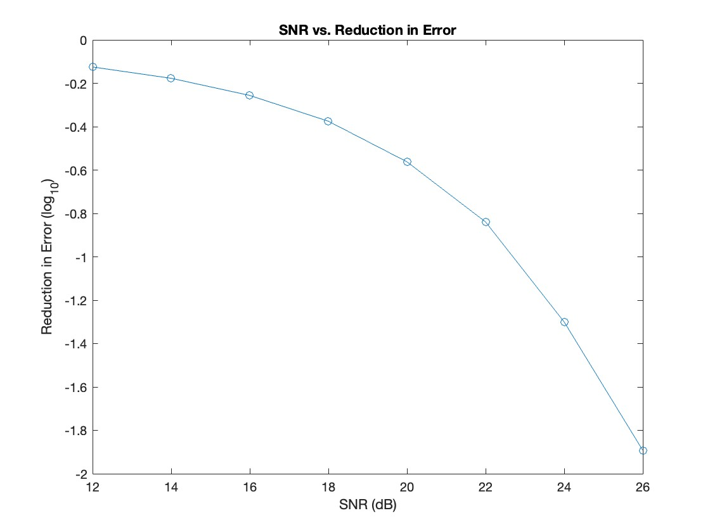
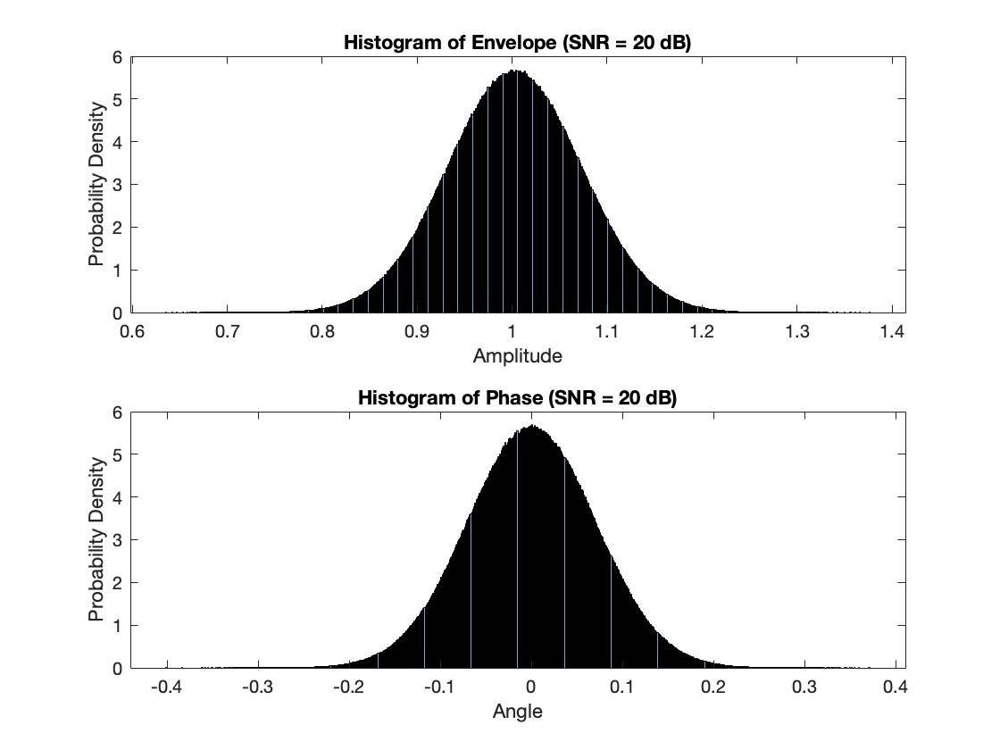
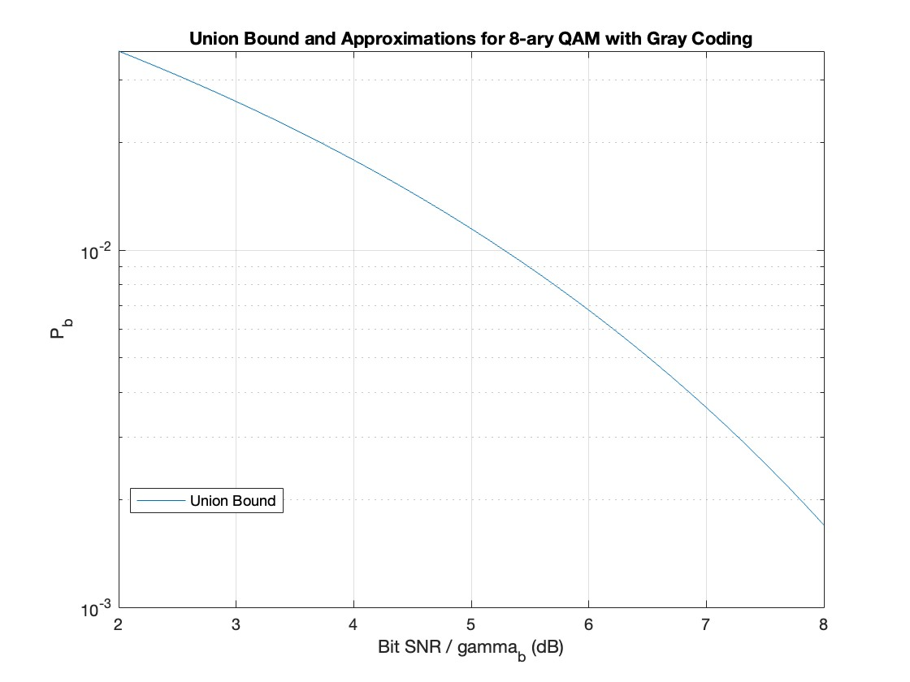
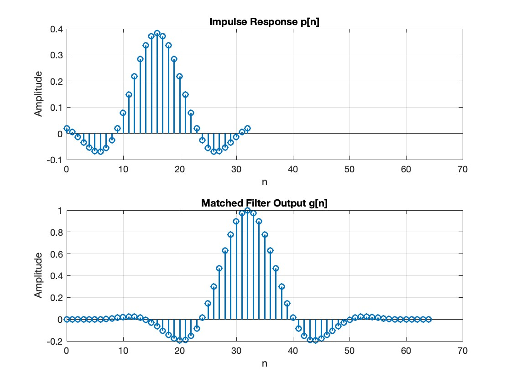

# Communication Systems Projects

This repository contains several MATLAB projects related to various aspects of communication systems and signal processing. Each project demonstrates different concepts and techniques used in modern communication systems.

## Table of Contents
1. [Analog Communication](#analog-communication)
2. [Decision Theory](#decision-theory)
3. [Digital Communications](#digital-communications)
4. [Fourier Transform Analysis](#fourier-transform-analysis)
5. [Information Theory](#information-theory)
6. [Intersymbol Interference Simulation](#intersymbol-interference-simulation)

## Analog Communication

**File:** `AnalogCommunication.m`

This project focuses on analyzing the effects of noise on analog communication systems. It includes:

- Generation of noise realizations
- Analysis of envelope and phase distributions for different SNR values
- Calculation and plotting of threshold probability vs. SNR

### Key Features:
- Histogram generation for envelope and phase distributions
- SNR vs. log10(P_TH) plot
- Analysis of error reduction with increasing SNR

## Decision Theory

**File:** `DecisionTheory.m`

This project implements and compares Maximum A Posteriori (MAP) and Maximum Likelihood (ML) decision theories in a communication context. It includes:

- Implementation of MAP and ML decision rules
- Simulation of error probabilities
- Comparison of theoretical and simulated error rates

### Key Features:
- Calculation of likelihoods and posterior probabilities
- Implementation of decision rules
- Error rate simulation and comparison

## Digital Communications

**File:** `DigitalCommunications.m`

This project explores various aspects of digital communication systems, including:

- Calculation of bit error probabilities
- Phase encoding for digital modulation
- Analysis of QAM constellations

### Key Features:
- Calculation of SNR requirements for given bit error rates
- Phase encoding for different bit sequences
- Union bound analysis for 8-ary QAM with Gray coding

## Fourier Transform Analysis

**File:** `FourierTrans.m`

This project focuses on the application of Fourier Transform in communication systems, including:

- Analysis of M-ary PAM systems
- Spectral analysis of communication signals
- Time-domain analysis of filtered signals

### Key Features:
- Eb/dmin^2 vs. k plot for M-ary PAM
- Spectral analysis of a communication signal
- Time-domain representation of a filtered signal

## Information Theory

**File:** `InformationTheory.m`

This project explores concepts from information theory, including:

- Channel capacity analysis
- Water-filling algorithm implementation
- Rate-distortion analysis

### Key Features:
- Channel capacity vs. error probability plot
- Implementation of the water-filling algorithm
- Rate-distortion curve generation

[Insert screenshots of the channel capacity plot and rate-distortion curve here]

## Intersymbol Interference Simulation

**File:** `IntersymbolInterferenceSim.m`

This project simulates and analyzes intersymbol interference (ISI) in digital communication systems. It includes:

- Design and analysis of raised cosine filters
- ISI analysis and SIR calculation
- BER simulation for different SNR values

### Key Features:
- Impulse response and matched filter output plots
- Worst-case ISI calculation
- BER simulation for various SNR values

## How to Use

1. Clone this repository to your local machine.
2. Open MATLAB and navigate to the repository folder.
3. Run each `.m` file to see the results and generated plots.
4. Refer to the comments within each file for detailed explanations of the implemented algorithms and analyses.

## Requirements

- MATLAB (version R2019b or later recommended)
- Signal Processing Toolbox
- Communications Toolbox

## Author

Raymond Chi

